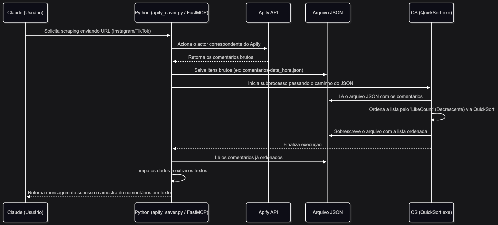

# Diagrama de sequência

# Apify MCP Comments Scraper & Sorter

Este projeto consiste em um servidor do Model Context Protocol (MCP) que permite que assistentes virtuais (como o Claude) extraiam e analisem comentários do Instagram e do TikTok. A arquitetura divide a extração de dados e o processamento de ordenação em dois scripts complementares (Python e C#).

## Arquitetura e Funcionamento Essencial

O sistema funciona por meio de três etapas principais de processamento:

* **Integração e Extração (Python/FastMCP):** 
  * O servidor expõe duas ferramentas (`scrape_instagram` e `scrape_tiktok`) ao Claude usando a biblioteca `FastMCP`. 
  * Ao receber uma URL de um post, o script utiliza o `ApifyClient` para acionar os atores de scraping do Apify e limitar a coleta a até 700 comentários. 
  * Os dados obtidos são salvos localmente em um arquivo de formato JSON.

* **Processamento e Ordenação (C#):**
  * Após a extração, o script Python invoca um executável desenvolvido em C# (`QuickSort.exe`) como um subprocesso, passando o caminho do arquivo JSON salvo.
  * O programa em C# abre esse arquivo e desserializa os dados em uma lista de objetos.
  * É aplicado um algoritmo de `QuickSort` para ordenar os comentários do maior para o menor engajamento, tendo como base a propriedade `LikeCount`.
  * O mesmo arquivo JSON é então sobrescrito pela versão da lista já ordenada.

* **Retorno de Contexto (Python):**
  * O script Python abre o arquivo JSON recém-ordenado pelo C#.
  * O código extrai a propriedade de texto de cada comentário e gera uma lista limpa.
  * Uma amostra de comentários textuais é formatada e retornada diretamente para o contexto do chat do Claude, permitindo que a IA analise o que foi extraído.